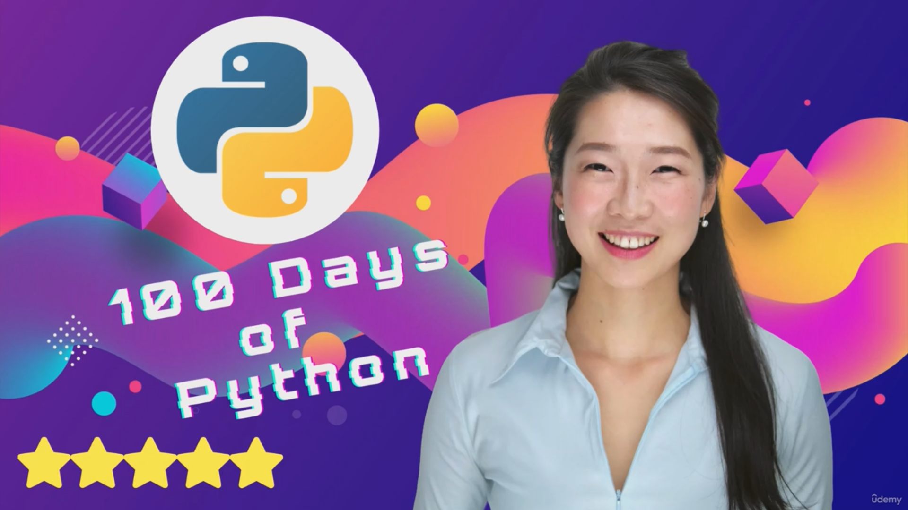

<h1> 100 Days of Python Bootcamp by Angela Yu</h1>

---
Este repositorio contiene código y proyectos completados durante el bootcamp "100 Days of Python" de Angela Yu. Este
bootcamp es un curso intensivo de programación que cubre una amplia gama de temas en programación Python.

## Tabla de contenido

1. [Comenzando](#getting-started)
2. [Acerca del curso](#about-the-course)
3. [Plan de estudios](#-beginner)
4. [Recursos](#resources)

---